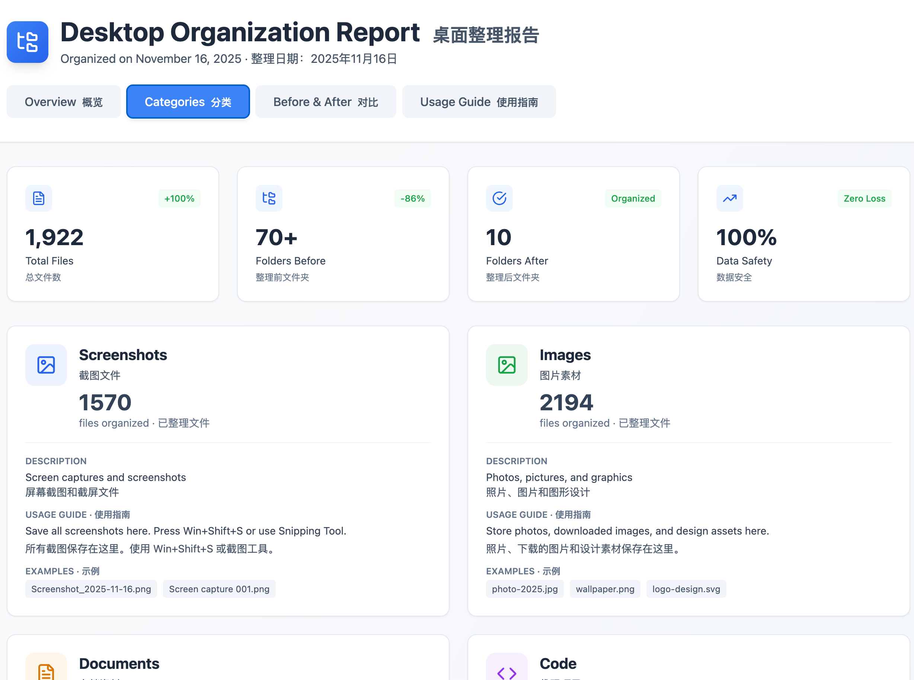

# FreeU - AI文件整理助手



基于多AI提供商支持的本地文件整理工具，让普通用户通过自然语言指令轻松整理文件。支持Claude、OpenAI、Kimi、GLM、OpenRouter等多个AI提供商。

## 功能特点

- 🎯 **自然语言交互**：用日常语言描述整理需求
- 🤖 **多AI支持**：支持Claude、OpenAI、Kimi、GLM、OpenRouter等多个AI提供商
- 👀 **预览确认**：先展示整理方案，用户确认后执行
- 🔒 **安全可靠**：只移动文件，不删除，支持撤销
- 💻 **桌面应用**：Electron打包，无需命令行操作
- ⚙️ **灵活配置**：支持多个AI提供商，用户可自由选择

## 技术架构

- **前端**：Gradio Web UI
- **后端**：Python 3.9+
- **AI引擎**：多AI提供商支持（Claude、OpenAI、Kimi、GLM、OpenRouter）
- **桌面打包**：Electron

## 快速开始

### 开发环境

```bash
# 安装依赖
pip install -r requirements.txt

# 启动应用
python src/main.py
```

### 配置AI提供商

首次使用时，应用会提示配置AI提供商。你也可以通过Web界面或手动创建配置文件：

#### 通过Web界面配置
1. 启动应用后，点击"AI设置"标签页
2. 选择AI提供商（Claude、OpenAI、Kimi、GLM、OpenRouter）
3. 输入对应的API Key
4. 点击"保存配置"

#### 手动配置文件
```bash
mkdir -p ~/.freeu
cat > ~/.freeu/config.json << EOF
{
    "ai_provider": "claude",
    "ai_providers": {
        "claude": {
            "api_key": "your-anthropic-api-key",
            "model": "claude-3-5-sonnet-20241022",
            "enabled": true
        },
        "openai": {
            "api_key": "your-openai-api-key", 
            "model": "gpt-4-turbo-preview",
            "enabled": false
        },
        "kimi": {
            "api_key": "your-moonshot-api-key",
            "model": "moonshot-v1-8k",
            "enabled": false
        },
        "glm": {
            "api_key": "your-zhipu-api-key",
            "model": "glm-4",
            "enabled": false
        },
        "openrouter": {
            "api_key": "your-openrouter-api-key",
            "model": "anthropic/claude-3.5-sonnet",
            "enabled": false
        }
    }
}
EOF
```

## 使用示例

1. 选择要整理的目录（如桌面）
2. 选择AI提供商（Claude、OpenAI、Kimi、GLM、OpenRouter）
3. 输入自然语言指令："把图片放到Pictures，文档放到Docs"
4. 查看AI生成的整理方案
5. 确认无误后点击"执行"

## 安全说明

- 只操作用户指定的目录
- 不会删除任何文件
- 自动跳过系统文件和隐藏文件
- 所有操作都有详细日志记录

## 开发计划

- [x] 基础框架搭建
- [x] 文件扫描模块
- [x] Claude AI集成
- [x] Gradio UI界面
- [x] 文件操作执行
- [x] 错误处理和日志
- [x] **多AI提供商支持** ✅ 新增
- [x] **AI配置管理界面** ✅ 新增
- [ ] Electron桌面打包
- [ ] 多语言支持
- [ ] 高级规则引擎

## 许可证

MIT License